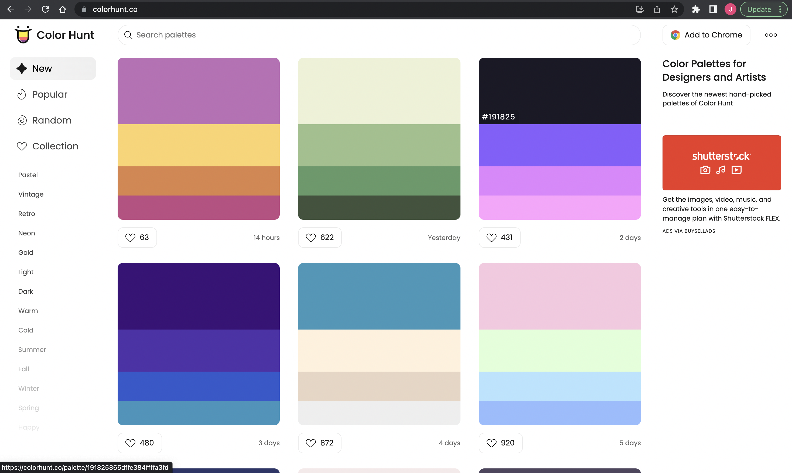
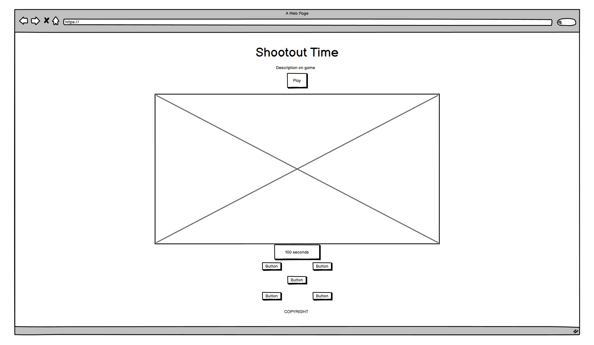
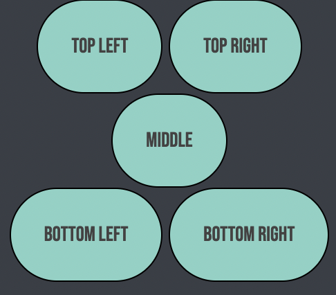
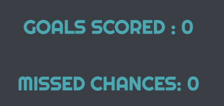

# SHOOTOUT TIME

## UX

### Colour Scheme

Explain your colours and the colour scheme.

- `#00ABB3` used for primary text.
- `#393E46` used for background.
- `#434242` used for button background.
- `#0A2647` used for countdown background.

I used [colorhunt.co](https://colorhunt.co/) to generate my colour palette.

### Typography

- [Righteous](https://fonts.google.com/specimen/Righteous?query=righte) was used for the primary headers and titles.

- [Bebas Neue](https://fonts.google.com/specimen/Bebas+Neue) was used for the buttons.

- [Shadows into Light](https://fonts.google.com/specimen/Shadows+Into+Light) was used for the main heading.

- [Font Awesome](https://fontawesome.com) icons were used throughout the site, such as the social media icons in the footer.

## User Stories

### New Site Users

- As a new site user, I would like to play a game of penalties, so that I can score penalties.
- As a new site user, I would like to score penalties, so that I can get a high score.
- As a new site user, I would like to not miss penalties, so that I can have a low missed score.
- As a new site user, I would like to see how many pnealties I can take in 100 seconds, so that I can score as many as possible in that time.

### Returning Site Users

- As a returning site user, I would like to beat my previous goals scored, so that I can beat my previous best.
- As a returning site user, I would like to score as many goals in 100 seconds, so that I can get the most goals as possible.
- As a returning site user, I would like to improve my score, so that I can beat my previous best.
- As a returning site user, I would like to score more then missed, so that I can say I beat the goalkeeper in penalties.

## Wireframes

I've used [Balsamiq](https://balsamiq.com/wireframes) to design my site wireframes.

### Home Page Wireframes

| Size | Screenshot |
| --- | --- |
| Mobile |  |
| Desktop |  |

## Features

### Existing Features

- **Feature #1**

    - Five options for where to kick the penalty!

- **Feature #2**

    - 100 second timer which starts when play is clicked!

- **Feature #3**

    - Goals scored and missed counter above game area!

### Future Features

- Cool new feature #1
    - Being able to click on goals to click where to shoot rather then buttons.
- Cool new feature #2
    - Being able to change the seconds countdown to whichever time you want.
- Cool new feature #3
    - A leaderboard to see who has the most goals.

## Tools & Technologies Used

- [HTML](https://en.wikipedia.org/wiki/HTML) used for the main site content.
- [CSS](https://en.wikipedia.org/wiki/CSS) used for the main site design and layout.
- [CSS Flexbox](https://www.w3schools.com/css/css3_flexbox.asp) 
- [JavaScript](https://www.javascript.com) used for user interaction on the site.
- [Git](https://git-scm.com) used for version control. (`git add`, `git commit`, `git push`)
- [GitHub](https://github.com) used for secure online code storage.
- [GitHub Pages](https://pages.github.com) used for hosting the deployed front-end site.
- [Gitpod](https://gitpod.io) used as a cloud-based IDE for development.
- [Markdown Builder by Tim Nelson](https://traveltimn.github.io/markdown-builder) used to help generate the Markdown files.

## Testing

For all testing, please refer to the [TESTING.md](TESTING.md) file.

## Deployment

The site was deployed to GitHub Pages. The steps to deploy are as follows:
- In the [GitHub repository](https://github.com/JoshuaCarroll1/Shootout-Time), navigate to the Settings tab 
- From the source section drop-down menu, select the **Main** Branch, then click "Save".
- The page will be automatically refreshed with a detailed ribbon display to indicate the successful deployment.

The live link can be found [here](https://joshuacarroll1.github.io/Shootout-Time)

### Local Deployment

This project can be cloned or forked in order to make a local copy on your own system.

#### Cloning

You can clone the repository by following these steps:

1. Go to the [GitHub repository](https://github.com/JoshuaCarroll1/Shootout-Time) 
2. Locate the Code button above the list of files and click it 
3. Select if you prefer to clone using HTTPS, SSH, or GitHub CLI and click the copy button to copy the URL to your clipboard
4. Open Git Bash or Terminal
5. Change the current working directory to the one where you want the cloned directory
6. In your IDE Terminal, type the following command to clone my repository:
	- `git clone https://github.com/JoshuaCarroll1/Shootout-Time.git`
7. Press Enter to create your local clone.

Alternatively, if using Gitpod, you can click below to create your own workspace using this repository.

Please note that in order to directly open the project in Gitpod, you need to have the browser extension installed.
A tutorial on how to do that can be found [here](https://www.gitpod.io/docs/configure/user-settings/browser-extension).

#### Forking

By forking the GitHub Repository, we make a copy of the original repository on our GitHub account to view and/or make changes without affecting the original owner's repository.
You can fork this repository by using the following steps:

1. Log in to GitHub and locate the [GitHub Repository](https://github.com/JoshuaCarroll1/Shootout-Time)
2. At the top of the Repository (not top of page) just above the "Settings" Button on the menu, locate the "Fork" Button.
3. Once clicked, you should now have a copy of the original repository in your own GitHub account!

### Local VS Deployment

Use this space to discuss any differences between the local version you've developed, and the live deployment site on GitHub Pages.

## Credits

### Content

| Source | Location | Notes |
| --- | --- | --- |
| [Markdown Builder by Tim Nelson](https://traveltimn.github.io/markdown-builder) | README and TESTING | tool to help generate the Markdown files |
| [Chris Beams](https://chris.beams.io/posts/git-commit) | version control | "How to Write a Git Commit Message" |
| [W3Schools](https://www.w3schools.com/howto/howto_js_topnav_responsive.asp) | entire site | responsive HTML/CSS/JS navbar |
| [W3Schools](https://www.w3schools.com/howto/howto_css_modals.asp) | contact page | interactive pop-up (modal) |
| [W3Schools]( https://www.w3schools.com/howto/howto_js_countdown.asp) | countdown timer | how to make a countdown timer |
| [Flexbox Froggy](https://flexboxfroggy.com/) | entire site | modern responsive layouts |

### Media

| Source | Location | Type | Notes |
| --- | --- | --- | --- |
| [pngwing](https://w1.pngwing.com/pngs/661/459/png-transparent-american-football-sports-icon-design-black-and-white-line-circle-symmetry-area.png) | entire site | image | favicon on all pages |

### Acknowledgements

- I would like to thank my Code Institute mentor, [Tim Nelson](https://github.com/TravelTimN) for their support throughout the development of this project.
- I would like to thank the [Code Institute](https://codeinstitute.net) tutor team for their assistance with troubleshooting and debugging some project issues.
- I would like to thank the [Code Institute Slack community](https://code-institute-room.slack.com) for the moral support; it kept me going during periods of self doubt and imposter syndrome.
- I would like to thank my girlfriend, Justyna for believing in me, and motivating me to study more.
- I would like to thank my parents, for supporting me in my career development change towards becoming a software developer.
