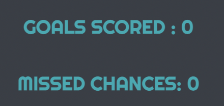

# Testing

Return back to the [README.md](README.md) file.

## Code Validation

### HTML

I have used the recommended [HTML W3C Validator](https://validator.w3.org) to validate all of my HTML files.

| Page | W3C URL | Screenshot | Notes |
| --- | --- | --- | --- |
| Home | [W3C](https://validator.w3.org/nu/?doc=https%3A%2F%2FJoshuaCarroll1.github.io%2FShootout-Time%2Findex.html) |  | Section lacks header h2-h6 warning |

### CSS

I have used the recommended [CSS Jigsaw Validator](https://jigsaw.w3.org/css-validator) to validate all of my CSS files.

| File | Jigsaw URL | Screenshot | Notes |
| --- | --- | --- | --- |
| style.css | [Jigsaw](https://jigsaw.w3.org/css-validator/validator?uri=https%3A%2F%2FJoshuaCarroll1.github.io%2FShootout-Time) |  | Pass: No Errors |

### JavaScript

I have used the recommended [JShint Validator](https://jshint.com) to validate all of my JS files.

| File | Screenshot | Notes |
| --- | --- | --- |
| script.js |  | Unused variables from external files |

## Browser Compatibility

I've tested my deployed project on multiple browsers to check for compatibility issues.

| Browser | Screenshot | Notes |
| --- | --- | --- |
| Chrome |  | Works as expected |
| Firefox |  | Works as expected |
| Edge |  | Works as expected |
| Safari |  | Minor CSS differences |
| Brave |  | Works as expected |

## Responsiveness

I've tested my deployed project on multiple devices to check for responsiveness issues.

| Device | Screenshot | Notes |
| --- | --- | --- |
| Mobile (DevTools) |  | Works as expected |
| Tablet (DevTools) |  | Works as expected |
| Desktop |  | Works as expected |
| Nest Hub |  | Works as expected |
| iPhone 12 |  | Works as expected |

## Lighthouse Audit

I've tested my deployed project using the Lighthouse Audit tool to check for any major issues.

| Page | Size | Screenshot | Notes |
| --- | --- | --- | --- |
| Home | Mobile |  | Some minor warnings |
| Home | Desktop |  | Few warnings |

## Defensive Programming

Defensive programming was manually tested with the below user acceptance testing:

| Page | User Action | Expected Result | Pass/Fail | Comments |
| --- | --- | --- | --- | --- |
| Home Page | Click on Play button | Redirection to start game| Pass |  |
| Home Page | Click on Info button | Redirection to modal page | Pass | |    
| Home Page | Click on Restart button | Redirection to restart game| Pass |  |
| Home Page | Click on top left button | Redirection to score/miss goal | Pass |  |
| Home Page | Click on top right button | Redirection to score/miss goal | Pass |  |
| Home Page | Click on bottom left button | Redirection to score/miss goal | Pass |  |
| Home Page | Click on bottom right button | Redirection to score/miss goal | Pass |  |
| Home Page | Click on middle button | Redirection to score/miss goal | Pass |  |

## User Story Testing

| User Story | Screenshot |
| --- | --- |
| As a new site user, I would like to take penalties, so that I can score goals. |  |
| As a new site user, I would like to choose any direction, so that I can score different goals. |  |
| As a new site user, I would like to score as many goals as possible, so that I can get a high score. |  |
| As a returning site user, I would like to score more goals then before, so that I can see I am getting better. |  |
| As a returning site user, I would like to take penalties quicker, so that I can improve how many penalties I take in the 100 seconds. |  |
| As a returning site user, I would like to improve, so that I can beat my previous high score. |  |

## Bugs

### GitHub **Issues**

**Fixed Bugs**

All previously closed/fixed bugs can be tracked [here](https://github.com/JoshuaCarroll1/Shootout-Time/issues?q=is%3Aissue+is%3Aclosed).

| Bug | Status |
| --- | --- |
| [Play button still clickable after game over](https://github.com/JoshuaCarroll1/Shootout-Time/issues/1) | Closed |

**Open Issues**

I have no open issues at the time of project submission.

## Unfixed Bugs

There are no remaining bugs that I am aware of.
 